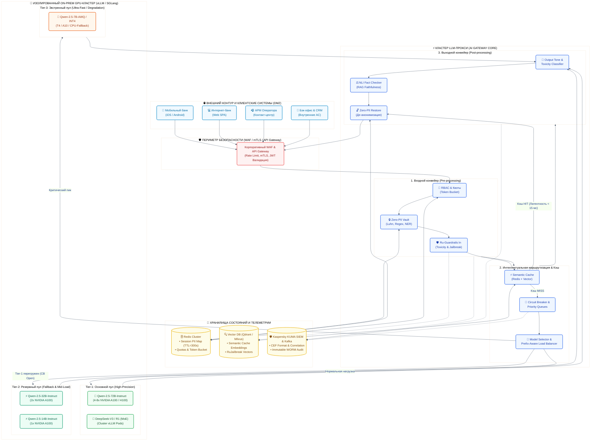
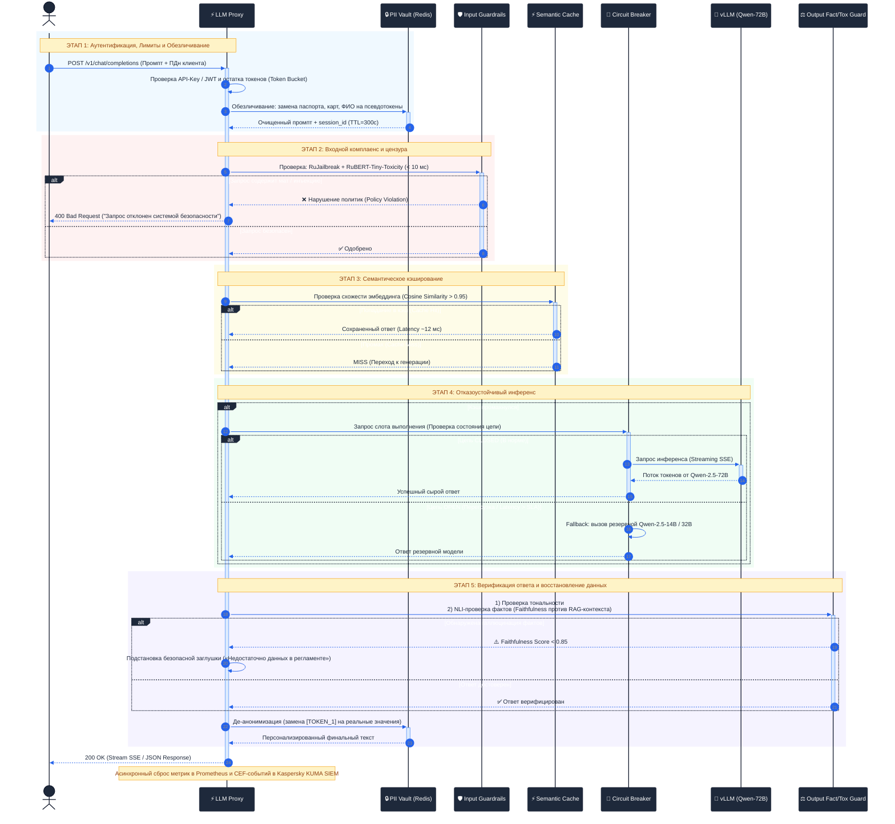
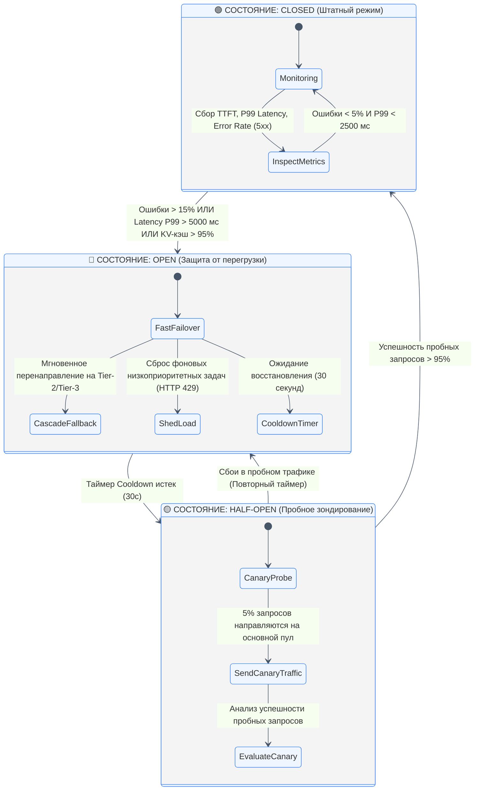
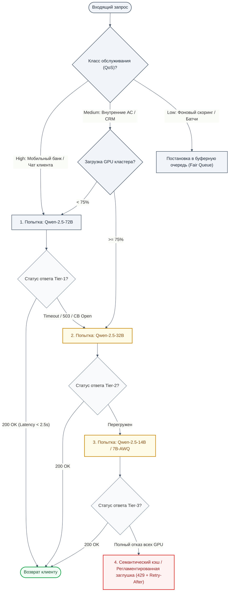
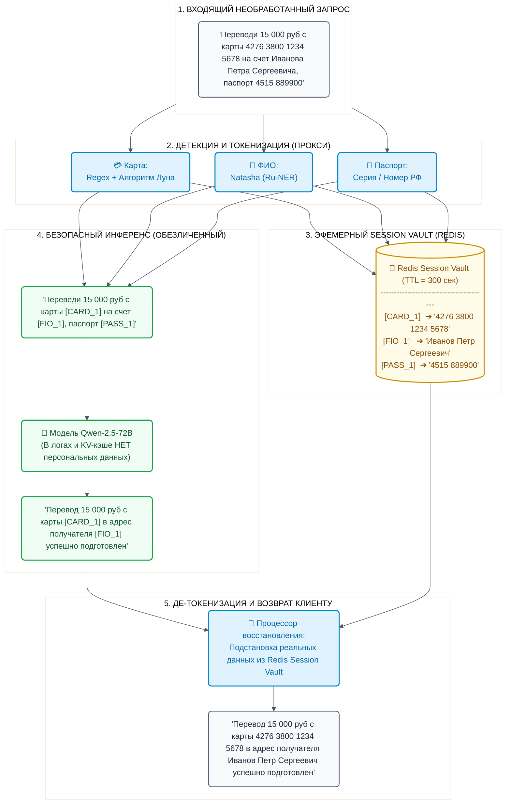
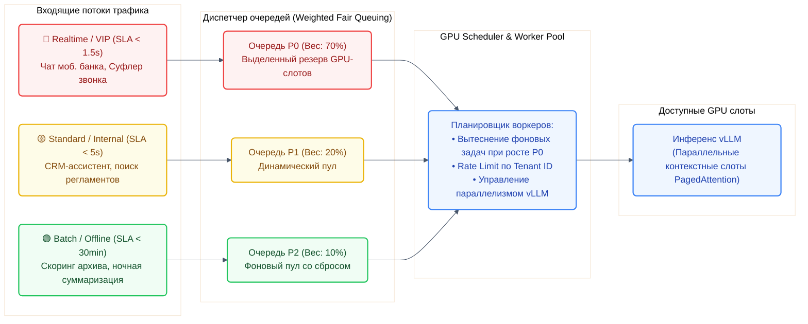

# Архитектурные решения: Корпоративный LLM-прокси (AI Gateway) для банка

Документ описывает техническую архитектуру, компоненты, алгоритмы устойчивости к нагрузкам, механизмы российской цензуры, защиты персональных данных и предотвращения галлюцинаций в корпоративном LLM-шлюзе банка (с акцентом на работу с китайскими моделями семейств **Qwen 2.5** и **DeepSeek**).

---

## 1. Архитектурные цели и принципы проектирования

```
┌─────────────────────────────────────────────────────────────────────────────┐
│                       КЛЮЧЕВЫЕ АРХИТЕКТУРНЫЕ СТОЛПЫ                         │
├───────────────────┬────────────────────┬──────────────────┬─────────────────┤
│   Zero-Trust &    │ High Availability  │ Low Latency &    │ Explainability  │
│  Data Sovereignty │  & Overload Guard  │ Smart Caching    │ & Fact Integrity│
│  (152-ФЗ / 395-1) │ (Circuit Breaker)  │  (< 20 ms tax)   │ (NLI Grounding) │
└───────────────────┴────────────────────┴──────────────────┴─────────────────┘
```

1. **Изоляция данных (Zero-Trust & Air-Gap):** Прокси и все модели инференса разворачиваются исключительно во внутреннем закрытом контуре банка. Ни один байт данных клиентов не покидает сетевой периметр.
2. **Нулевая утечка ПДн в веса и логи (Zero-PII Vault):** Персональные данные и банковская тайна маскируются до попадания в модель и размаскируются перед выдачей клиенту. Модель оперирует только синтетическими псевдотокенами.
3. **Устойчивость к исчерпанию GPU (Adaptive Overload Protection):** Инференс больших моделей нестабилен по времени и памяти. Архитектура гарантирует непрерывность обслуживания через Circuit Breaker, адаптивный сброс очередей (Load Shedding) и каскадный фоллбэк на более легкие квантованные модели.
4. **Двухуровневые Guardrails без ущерба производительности:** Легковесные классификаторы (<10 мс) на входе и выходе; ресурсоемкий факт-чекинг (NLI) применяется только к RAG-сценариям с критичными финансовыми данными.
5. **Совместимость с OpenAI API:** Унифицированный протокол `/v1/chat/completions` со стримингом токенов (Server-Sent Events) для бесшовной интеграции с корпоративными сервисами банка.

---

## 2. Диаграмма 1: Общая топология корпоративного контура банка

Детальное разделение сетевых периметров: клиентские приложения в ДМЗ, кластер LLM-прокси в сервисном контуре и защищенный пул серверов инференса vLLM с моделями Qwen и DeepSeek.



---

## 3. Диаграмма 2: Сквозной жизненный цикл запроса (Sequence Diagram)

Визуализация полного пути обработки транзакции с подсветкой этапов жизненного цикла.



---

## 4. Диаграмма 3: Защита от перегрузки (Circuit Breaker & Fallback Cascade)

Детальная машина состояний с критериями перехода и алгоритм каскадного переключения моделей.



### Алгоритм каскадной деградации (Decision Tree)



---

## 5. Диаграмма 4: Двухуровневый конвейер цензуры и факт-чекинга (Guardrails Pipeline)

```mermaid
%%{init: {
  'theme': 'base',
  'themeVariables': {
    'primaryColor': '#eff6ff',
    'primaryBorderColor': '#3b82f6',
    'lineColor': '#475569',
    'fontFamily': 'Inter, system-ui, sans-serif'
  }
}}%%
flowchart LR
    subgraph STAGE_IN[" 🛡️ ЭТАП 1: Входные фильтры (Latency < 12 мс) "]
        direction TB
        RawIn["Исходный запрос клиента"] --> DetectJailbreak["Детектор инъекций:<br/>RuJailbreak + Cosine Similarity"]
        DetectJailbreak --> InpToxModel["RuBERT-Tiny-Toxicity:<br/>Мат, оскорбления, агрессия"]
        InpToxModel --> PII_Extractor["Экстрактор ПДн:<br/>Regex (карты/паспорта) + Natasha NER"]
        PII_Extractor --> CleanPrompt["Обезличенный валидный промпт"]
    end

    subgraph STAGE_LLM[" 🧠 ЭТАП 2: Инференс "]
        direction TB
        CleanPrompt --> ModelGen["vLLM Генерация<br/>(Qwen-2.5 on-prem)"]
        ModelGen --> RawAnswer["Ответ модели"]
    end

    subgraph STAGE_OUT[" ⚖️ ЭТАП 3: Выходной контроль и факт-чекинг "]
        direction TB
        RawAnswer --> OutToxCheck["Ru-Toxicity Check:<br/>Тональность ответа модели"]
        OutToxCheck --> StopTopics["Регуляторный стоп-лист:<br/>ФЗ-114, 149-ФЗ, запрещенные темы"]
        StopTopics --> NLI_Eval["NLI Cross-Encoder:<br/>mDeBERTa-v3 / RuBERT-NLI<br/>(Faithfulness vs RAG Context)"]
        NLI_Eval --> NumAudit["Числовой аудитор:<br/>Сверка ставок, сумм и дат"]
        NumAudit --> SchemaCheck["JSON Schema Validator<br/>(Structured Output)"]
        SchemaCheck --> FinalApproved["Верифицированный ответ"]
    end

    STAGE_IN ==> STAGE_LLM ==> STAGE_OUT

    classDef stageIn fill:#f0f9ff,stroke:#0284c7,stroke-width:2px,color:#0369a1,rx:6,ry:6;
    classDef stageLLM fill:#f0fdf4,stroke:#16a34a,stroke-width:2px,color:#14532d,rx:6,ry:6;
    classDef stageOut fill:#fdf4ff,stroke:#a855f7,stroke-width:2px,color:#581c87,rx:6,ry:6;

    class RawIn,DetectJailbreak,InpToxModel,PII_Extractor,CleanPrompt stageIn;
    class ModelGen,RawAnswer stageLLM;
    class OutToxCheck,StopTopics,NLI_Eval,NumAudit,SchemaCheck,FinalApproved stageOut;
```



---

## 6. Диаграмма 5: Zero-PII Vault (Токенизация банковской тайны)

Схема гарантирует, что номера банковских карт, паспортные данные и ФИО клиентов не сохраняются в логах инференса модели и не попадают в кэш.



---

## 7. Диаграмма 6: Схема очередей с приоритетами (Fair Priority Queuing & QoS)

Гарантия того, что клиенты в мобильном банке получают ответ без задержек, даже если бэк-офис запустил пакетный анализ миллионов документов.



---

## 8. Спецификация API и корпоративных заголовков

Прокси полностью поддерживает стандарт **OpenAI Chat Completions API**, расширяя его специфичными банковскими заголовками.

### 8.1. Заголовки запроса (Request Headers)
| Заголовок | Тип | Обязательный | Описание |
| :--- | :--- | :--- | :--- |
| `Authorization` | `Bearer <token>` | Да | Внутренний токен сервиса (интеграция с Keycloak / Единой платформой авторизации банка). |
| `X-Bank-Tenant-ID` | `string` | Да | Идентификатор подразделения/системы (`retail-mobile`, `contact-center`, `credit-underwriting`) для учета квот и биллинга (Chargeback). |
| `X-Bank-Priority` | `HIGH \| MEDIUM \| LOW` | Нет (default: `MEDIUM`) | Приоритет в очереди выполнения (Weighted Fair Queue). |
| `X-Bank-Guardrails` | `STRICT \| MODERATE \| AUDIT_ONLY` | Нет (default: `STRICT`) | Режим работы цензуры и детекции галлюцинаций. |
| `X-Bank-PII-Masking` | `BOOLEAN` | Нет (default: `true`) | Включение автоматического обезличивания персональных данных. |

### 8.2. Диагностические заголовки ответа (Response Headers)
| Заголовок | Значение | Описание |
| :--- | :--- | :--- |
| `X-LLM-Selected-Model` | `qwen-2.5-72b-instruct` | Модель, фактически выполнившая генерацию (с учетом фоллбэка). |
| `X-LLM-Fallback-Triggered` | `true \| false` | Флаг срабатывания каскадного переключения из-за перегрузки основного пула. |
| `X-LLM-Cache-Hit` | `true \| false` | Флаг мгновенного ответа из семантического кэша. |
| `X-LLM-TTFT-Ms` | `185` | Time-To-First-Token в миллисекундах. |
| `X-LLM-Total-Latency-Ms` | `840` | Полное время выполнения запроса со всеми проверками. |
| `X-Guardrails-Faithfulness` | `0.94` | Оценка достоверности фактов (NLI Score против переданного контекста). |

---

## 9. Рекомендуемый стек технологий для реализации

* **Ядро прокси (Gateway Core):** Python (FastAPI + AsyncIO + uvloop) ИЛИ Go (Gin/Fiber).
* **Сетевой балансировщик и Ingress:** Envoy Proxy / Nginx с поддержкой HTTP/2 и стриминга SSE.
* **Хранилище сессий и очередей:** Redis Cluster (распределенный Token Bucket, эфемерный Vault для ПДн с TTL).
* **Векторный поиск для кэша:** Qdrant / Milvus (хранение эмбеддингов типовых вопросов с порогом косинусной близости 0.95).
* **ML-компоненты безопасности (Ru-Guardrails on CPU/ONNX):**
  * `cointegrated/rubert-tiny-toxicity` (ONNX Runtime, задержка < 8 мс на обычном CPU).
  * `mDeBERTa-v3-base-xnli` (ONNX Runtime, NLI-верификация фактов).
  * Библиотека `natasha` + Сборка оптимизированных регулярных выражений (карты, паспорта, телефоны).
* **Инференс моделей:** vLLM / SGLang в Kubernetes (интеграция по стандартному протоколу vLLM OpenAI API).
* **Наблюдаемость и SIEM:** Prometheus (метрики RPS, TTFT, квоты) + Grafana + **Kaspersky KUMA SIEM** (неизменяемый WORM-аудит ИБ в формате CEF, Kafka topic `alfa.kuma.ai-gateway.events`).
* **Экосистема защиты контейнеров и хостов:** **Kaspersky Container Security (KCS)** (сканирование CVE образов и рантайм-защита подов Kubernetes) + **Kaspersky Security for Storage (KSS)** (проверка RAG-документов до векторизации) + **Kaspersky Anti Targeted Attack (KATA) / EDR Expert** (защита закрытого сегмента GPU-инференса).

---

## 10. Модель угроз и компенсация рисков

Полная спецификация модели угроз и архитектуры эшелонированной защиты представлена в отдельном документе:
👉 **[Модель угроз безопасности и компенсация рисков](file:///Users/victor/work/СТРАННОЕ/alfa/docs/THREAT_MODEL_AND_KASPERSKY_INTEGRATION.md)**

### Краткая сводка эшелонированной защиты:
1. **Kaspersky Unified Monitoring and Analysis Platform (KUMA SIEM):**
   * Прием событий аудита шлюза по стандарту CEF (Common Event Format) через mTLS Syslog или Kafka.
   * Реализация 4 специализированных правил корреляции: `ALFA_AI_001_JAILBREAK_BURST`, `ALFA_AI_002_MASS_DEANONYMIZATION`, `ALFA_AI_003_CIRCUIT_BREAKER_TRIPPED`, `ALFA_AI_004_SYSTEMATIC_HALLUCINATIONS`.
2. **Kaspersky Container Security (KCS):**
   * Предотвращение уязвимостей в цепочке поставок (Supply Chain): сканирование базовых образов Python 3.11 и бинарных зависимостей vLLM на известные CVE.
   * Контроль рантайма подов (`readOnlyRootFilesystem`), блокировка запуска несанкционированных процессов и попыток Container Escape.
3. **Kaspersky Security for Storage (KSS):**
   * Потоковая антивирусная и эвристическая проверка клиентских файлов и банковских выписок (PDF, DOCX) **до** их парсинга и занесения чанков в векторную базу Qdrant (защита от RAG Poisoning).
4. **Kaspersky Anti Targeted Attack (KATA) & EDR Expert:**
   * Глубокий анализ L7-трафика между шлюзом и кластером инференса vLLM; защита пространства ядра и CUDA-драйверов на физических нодах с NVIDIA A100.

